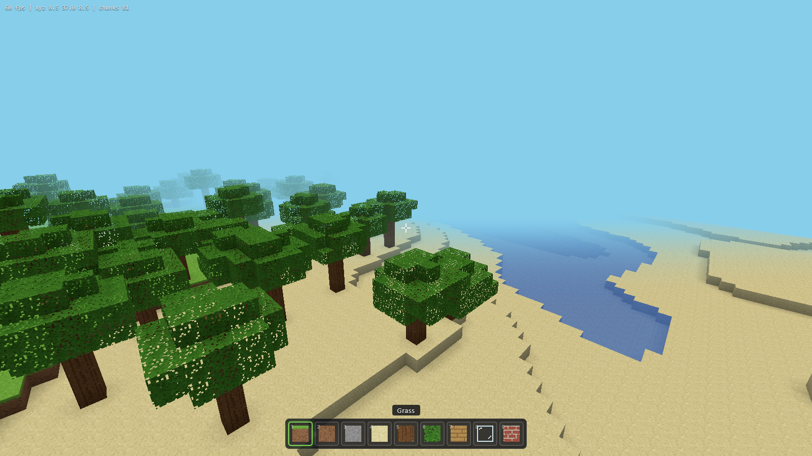
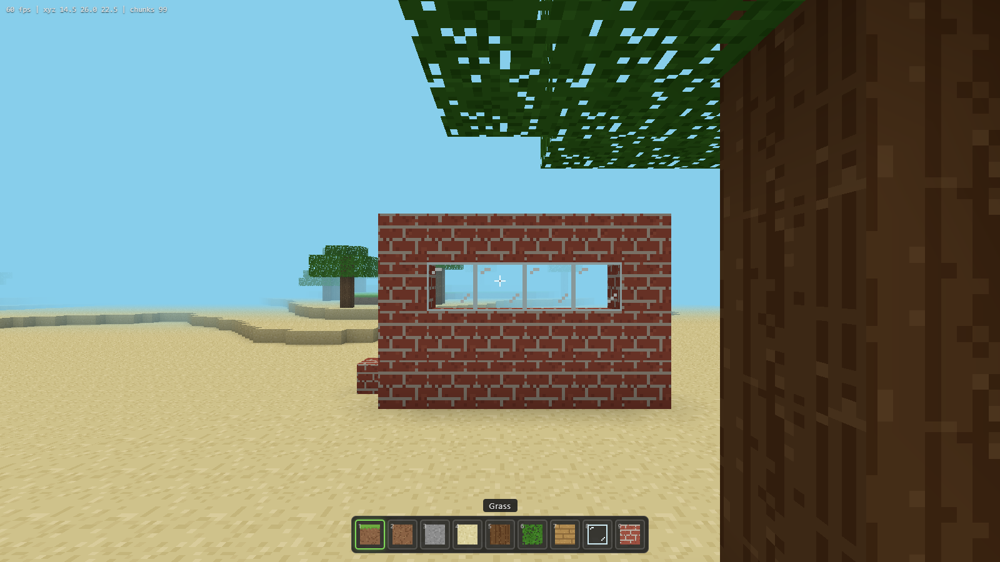
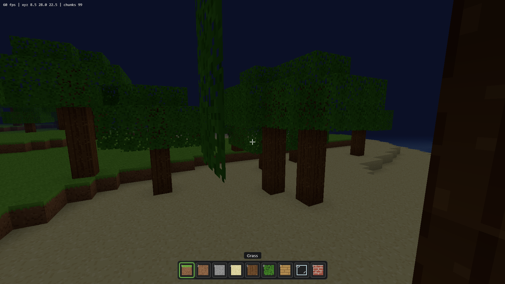

# CloneMC

Minecraft-inspired voxel sandbox chạy trực tiếp trên trình duyệt. Viết bằng JavaScript thuần + Three.js, không có build step, không dùng asset ngoài (texture pixel được vẽ procedural bằng canvas).

> Dự án phi thương mại, làm để học/demo. Không liên quan tới Mojang/Microsoft.



| Xây dựng | Ban đêm |
|---|---|
|  |  |

## Chơi thử

```bash
# cần một static server bất kỳ (ES modules không chạy qua file://)
cd CloneMC
python -m http.server 8000
# hoặc: npx serve
```

Mở `http://localhost:8000` và bấm **Chơi**.

## Tính năng

- **Terrain procedural vô hạn** — đồi, núi, biển, bãi cát, hang động (3D noise), cây mọc tự nhiên (xuyên biên chunk không bị cụt)
- **Đào / đặt block** — raycast DDA, 12 loại block, hotbar 9 ô, middle-click để pick block
- **Vật lý** — AABB collision, nhảy, chạy nhanh, bơi (chìm/nổi trong nước), chế độ bay
- **Render** — chunk meshing có face culling + baked ambient occlusion per-vertex, nước trong suốt, lá cây cutout
- **Chu kỳ ngày đêm** — mặt trời xoay, màu trời/sương mù chuyển dần, hoàng hôn
- **Lưu world** — mọi block đã sửa + vị trí player lưu vào localStorage, seed cố định
- **Âm thanh** — SFX đào/đặt sinh bằng WebAudio, không cần file âm thanh

## Điều khiển

| Phím | Hành động |
|------|-----------|
| WASD | Di chuyển |
| Space | Nhảy / bơi lên / bay lên |
| Ctrl | Chạy nhanh |
| F | Bật/tắt bay |
| Shift | Hạ xuống (khi bay) |
| Chuột trái / phải / giữa | Đào / đặt / pick block |
| 1–9, lăn chuột | Đổi block trên hotbar |
| R | Về spawn |
| Esc | Tạm dừng |

## Cấu trúc code

```
index.html        UI shell + importmap
lib/              three.js (vendored, chạy offline được)
src/
  noise.js        value noise 2D/3D + fBm, seeded
  blocks.js       block registry + texture atlas vẽ bằng canvas
  worldgen.js     sinh terrain, hang động, cây
  world.js        quản lý chunk: stream in/out, edit, persistence
  mesher.js       dựng geometry: face culling + vertex AO
  raycast.js      voxel raycast (Amanatides & Woo)
  player.js       physics + collision + swim/fly
  sky.js          chu kỳ ngày đêm
  ui.js           hotbar, highlight block, HUD
  audio.js        SFX bằng WebAudio
  main.js         entry point, game loop, input
```
